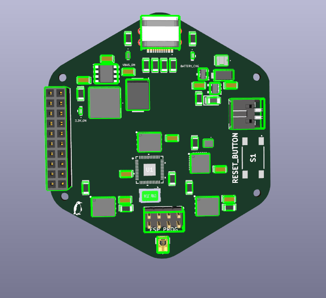
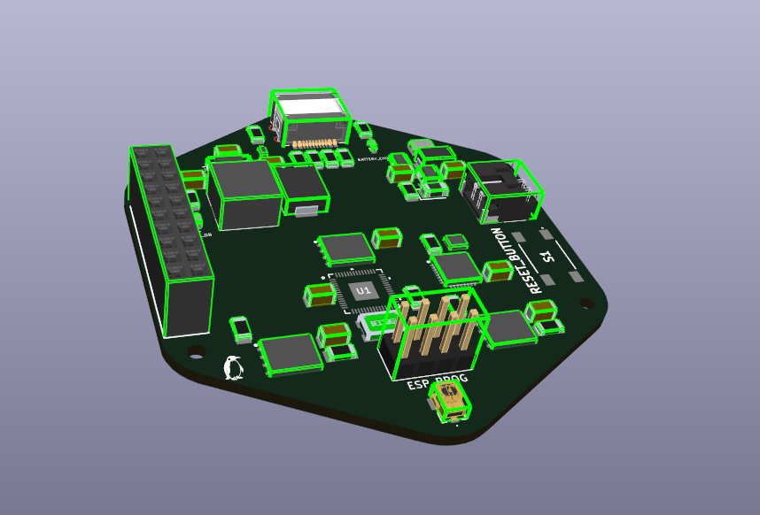

#🛰️ Altair – Embedded Sensor Node

Altair is a development board based on the RP2040 microcontroller, with WiFi connectivity provided by an ESP8266, designed for IoT applications, environmental sensing and embedded systems. Inspired by the star Altair, within the Aquila constellation, this board combines power, efficiency, and simplicity in a compact and adaptable format.

**Altair** is a compact, efficient, and versatile development board based on the **RP2040** microcontroller, featuring built-in **ESP8266** WiFi connectivity. Designed for environmental sensing, IoT applications, and embedded systems, the board is inspired by the star **Altair** in the **Aquila** constellation — combining performance and low power consumption in a single device.

---

## 🔧 Key Features

- 🎯 **Main MCU:** RP2040 (dual-core ARM Cortex-M0+ @ 133 MHz)
- 📡 **WiFi:** Integrated ESP8266
- 🌦️ **Environmental Sensor:** BME280 (temperature, humidity, and pressure)
- 📈 **Motion Sensing:** LIS3DHTR (3-axis accelerometer)
- 💾 **External Flash Memory** for additional storage
- 🔋 **Battery Charging via USB**
- 🔌 **USB Programming** for RP2040 (no adapter required)
- ⚙️ Ideal for portable applications, autonomous systems, and sensor networks

---

## 🖼️ Board Previews
<h2 align="center">🖼️ Board Previews</h2>

  

  

  

---
## 📦 Repository Structure

- `hardware/` – Schematics, PCB layout, and manufacturing files
- `firmware/` – Example firmware for RP2040
- `wifi/` – Communication interface with ESP8266 (UART, AT commands, etc.)
- `docs/` – Datasheets, diagrams, and technical documentation

---

## 🚀 Getting Started

1. Connect Altair via USB-C to your computer.
2. Hold the BOOTSEL button while plugging it in to mount it as a USB drive.
3. Drag and drop your compiled `.uf2` firmware onto the drive.
4. Use your preferred IDE (Arduino, PlatformIO, or Thonny) to start developing.

---

## 🛠️ Requirements

- Python 3.x (if using Thonny or MicroPython)
- Libraries for BME280 and the LIS3DHTR
- UART communication between RP2040 and ESP8266

---

## 🧠 Example Use Cases

- 📊 Portable weather station
- 🛰️ IoT node with WiFi or LoRa extension
- 🧭 Motion tracking in wearable devices
- 🧪 Educational embedded systems projects

---

## 📜 License

This project is licensed under the [MIT License].

---

## ✨ Credits

Developed by [César](https://github.com/Cesarziraci)  
Logo and name inspired by the **Aquila** constellation and its brightest star, **Altair**.

---

## 🌐 Contribute

Got ideas, feedback, or improvements? Fork the repo, open an issue, or submit a pull request — contributions are welcome!
